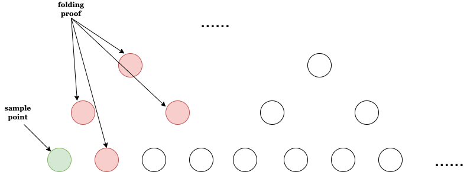
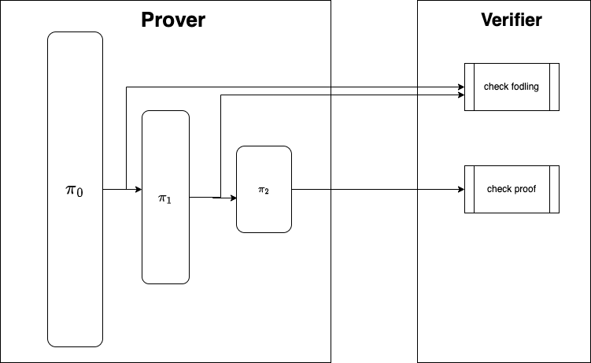

# Domain

Firstly we need to look into domain $D$, which the polynomial $p(x)$ defines over. 

 

## Traditional Domain

Usually the domain $D$ is a cyclic multiplicative sub-group $H$ defined over finite prime field $F_p$, say $F_{13}$, then $|F_{13}^{\times}| = |\langle 6 \rangle| = 12$, there is a order-$4$ subgroup:
$$
H = \langle 6^3 \rangle
$$
generally speaking:
$$
D = H = \langle g^m \rangle = \langle g_m \rangle
$$
where $g$ is generator of multiplicative group $F_{p}^{\times}$, and $g_m$ is the generator of $D$ or $H$.

 

Therefore we have the belowing evaluation table $Y = p(X)$,  where $X \in D$:
$$
\def\arraystretch{1.5}
   \begin{array}{c:c:c}
   X & 1 & g_m & g_m^2 & ... & g_m^{n - 1} \\ \hline
   Y & e_0 & e_1 & e_2 & ... & e_{n - 1}
\end{array}
$$
 
 
 
Obviousely $p(X)$ is a **univariate** polynomial, as $X$ is one-diamentional coordinate, and evaluation domain $D$ is a **multiplicative** group.

 

## Circle Domain

While in circle domain, $X$ is not one-diamentional coordinate anymore, it's two-diamentional coordinates, it's a **bivariate** polynomial $p(x, y)$, and its domain $D$ is a **additive** group rather a **multiplicative** group. 

 

Assuming there's a **additive** cyclic group $G$:
$$
G = \{(x, y); x^2 + y^2 = 1, x, y \in F_p \}
$$
where $|G| = |\langle g \rangle| = 64$. There is subgroup:
$$
D = H = \{ g + [i]g_2, i < 32 \}
$$
where $g_2 = [2] g$, we must have $|D| = 32$.

 

Therefore we have the following evaluation table $Y = p(X)$, where $X \in H$:
$$
\def\arraystretch{1.5}
   \begin{array}{c:c:c}
   X & g = (x_0, y_0) & [3]g = [3](x_0, y_0) & [5]g = [5](x_0, y_0) & ... & [63]g = [63](x_0, y_0) \\ \hline
   Y & e_0 & e_1 & e_2 & ... & e_{n - 1}
\end{array}
$$

 

Everthing looks well? actually it's not. 

 

If you take a close look at its domain $D$:
$$
D = H = \{ g + [i]g_2, i < 32 \}
$$
you'll notice that, it's not a **additive** cyclic group, as it does not even have a generator! So we must correct it, we can not call $D$ as a group anymore, maybe **domain** is more accurate.

 

# FFT

Secondly, given a vector of evaluations:
$$
e = [e_0, e_1, e_2, e_3, ..., e_{31}]
$$
we want to get its coefficient represented polynomial $p(x)$, aka polynomial coefficient vector, through a interpolation algorithm, say:
$$
c = [c_0, c_1, c_2, c_3, ..., c_{31}]
$$

This is what **FFT** does.

 

## Traditional FFT

#### First Round

Given **univairate polynomial** evaluation table $Y = p(X), X \in D = \{ g_m^i, i < n \}$:
$$
\def\arraystretch{1.5}
   \begin{array}{c:c:c}
   X & 1 & g_m & g_m^2 & ... & g_m^{n - 1} \\ \hline
   Y & e_0 & e_1 & e_2 & ... & e_{n - 1}
\end{array}
$$
we need to solve the coefficients of polynomial $p(X)$ through $FFT$ interpolation.

 

Divide $p(X)$ into two sub-polynomials $f_0(X)$ and $f_1(X)$:
$$
\def\arraystretch{1.5}
   \begin{array}{c:c:c}
   X^2 & 1 & g_m^2 & g_m^4 & ... & g_m^{n - 2} \\ \hline
   f_0(X^2) & \frac{e_0 + e_{n - 1}}{2} & \frac{e_1 + e_{n - 2}}{2} & \frac{e_2 + e_{n - 3}}{2} & ... & \frac{e_{n / 2 - 1} + e_{n / 2}}{2} \\ \hdashline
   f_1(X^2) & \frac{e_0 - e_{n - 1}}{2 \cdot 1} & \frac{e_1 - e_{n - 2}}{2 \cdot g_m} & \frac{e_2 - e_{n - 3}}{2 \cdot g_m^2} & ... & \frac{e_{n / 2 - 1} - e_{n / 2}}{2 \cdot g_m^{n / 2 - 1}} \\
\end{array} 
$$
where : 
$$
\begin{aligned}
p(X) = f_0(X^2) + X \cdot f_1(X^2) \\
\Longrightarrow \begin{cases}
f_0(X^2) = \frac{p(X) + p(-X)}{2} \\
f_1(X^2) = \frac{p(X) - p(-X)}{2 \cdot X} \\
\end{cases}
\end{aligned}
$$
.

 

The coefficient vector of polynomial $p(X)$ is reduced into coefficient vectors of $f_0(X^2)$ and $f_1(X^2)$ with halved domain size. 

 

Evaluation vector becomes:
$$
\begin{aligned}
p(X) = \{ e_0, e_1, e_2, e_3, ..., e_{31} \} \\
\Longrightarrow \begin{cases}
f_0(X^2) = \{ \frac{e_0 + e_{31}}{2}, \frac{e_1 + e_{30}}{2}, ... \} \\
f_1(X^2) = \{ \frac{e_0 - e_{31}}{2 \cdot 1}, \frac{e_1 + e_{30}}{2 \cdot g_2}, ... \} \\
\end{cases}
\end{aligned}
$$
Domain becomes:
$$
\begin{aligned}
D = \{ 1, g_2, g_4, g_6, ..., g_{62} \} \\
\Longrightarrow  D_1 = \{ 1, g_4, g_8, g_{12}, ..., g_{60} \} \\
\end{aligned}
$$

 

#### Second and The Rest Rounds

Given the evaluation table of $f_0(X)$:
$$
\def\arraystretch{1.5}
   \begin{array}{c:c:c}
   X & 1 & g_4 & g_8 & ... & g_{60} \\ \hline
   Y & \frac{e_0 + e_{31}}{2} & \frac{e_1 + e_{30}}{2} & \frac{e_2 + e_{29}}{2} & ... & \frac{e_{15} + e_{16}}{2} 
\end{array}
$$

 

Then coefficient vector of $f_0(X)$ is reduced into $f_{00}(X^2)$ and $f_{01}(X^2)$ with halved domain size again after applying **FFT** algorithm, similarily works for $f_1(X)$:
$$
\def\arraystretch{1.5}
   \begin{array}{c:c:c}
   X & 1 & g_4 & g_8 & ... & g_{60} \\ \hline
   Y & \frac{e_0 - e_{31}}{2 \cdot 1} & \frac{e_1 - e_{30}}{2 \cdot g_2} & \frac{e_2 - e_{29}}{2 \cdot g_4} & ... & \frac{e_{15} - e_{16}}{2 \cdot g_{30}} 
\end{array}
$$
apply **FFT** algorithm recursively on $f_0(X)$ and $f_1(X)$ $log{n}$ times, we'll get the final coefficients of **univaritate** polynomial $p(X)$.

 

## Circle FFT

#### First Round

Given **bivairate polynomial** evaluation table $Y = p(X), X \in D = \{ g + [i]g_2, i < n \}$:
$$
\def\arraystretch{1.5}
   \begin{array}{c:c:c}
   X & g = (x_0, y_0) & [3]g = [3](x_0, y_0) & [5]g = [5](x_0, y_0) & ... & [2n - 1]g = [2n - 1](x_0, y_0) \\ \hline
   Y & e_0 & e_1 & e_2 & ... & e_{n - 1}
\end{array}
$$
similarily we need to solve the coefficients of polynomial $p(X)$ through interpolation.

 

But the problem in front of us is that $X$ is a two-diamentional coordinates, say $X = (x, y)$, so the polynomial would be more complex than the one with one-diamentional coordinates. say:
$$
p(X) = p(x, y)= 3x + 2x^2 + y \cdot 5x^2 + y^2 \cdot 4 + y^3 \cdot 4x^3
$$
Luckly any $p(x, y)$ can also be converted into two sub-polynomials $f_0(x)$ and $f_1(x)$ as traditional **FFT** does:
$$
p(x, y) = f_0(x) + y \cdot f_1(x)
$$
since $(x, y)$ is circle points satisfying:
$$
x^2 + y^2 = 1
$$
we must have $y^2 = 1 - x^2$. so the above toy polynomial case can be divided into:
$$
\begin{aligned}
f_0(x) &= 3x + 2x^2 + (1 - x^2) \cdot 4\\
f_1(x) &= 5x^2 + (1 - x^2) \cdot 4x^3 \\
\end{aligned}
$$
It's a amazing property for circle domain, isn't it? 

 

The **bivariate** polynomial $p(x, y)$ can also be splitted into two **univariate** polynomials $f_0(x)$ and $f_1(x)$:
$$
\begin{aligned}
f_0(x) = \frac{p(x, y) + p(x, -y)}{2} \\
f_1(x) = \frac{p(x, y) - p(x, -y)}{2 \cdot y} \\
\end{aligned}
$$
the evaluation table of them would be like below:
$$
\def\arraystretch{1.5}
   \begin{array}{c:c:c}
   X & g & g_3 = [3]g & g_5 = [5]g & ... & g_{n - 1} = [n - 1]g \\ \hline
   f_0(x) = f_0(X.x) & \frac{e_0 + e_{31}}{2} & \frac{e_1 + e_{30}}{2} & \frac{e_2 + e_{29}}{2} & ... & \frac{e_{15} + e_{16}}{2} \\ \hdashline
   f_1(x) = f_1(X.x) & \frac{e_0 - e_{31}}{2 \cdot g.y} & \frac{e_1 - e_{30}}{2 \cdot g_3.y} & \frac{e_2 - e_{29}}{2 \cdot g_5.y} & ... & \frac{e_{15} - e_{16}}{2 \cdot g_{n - 1}.y} \\
\end{array}
$$
and the domain $X$ has already been halved.

 

#### Second and The Rest Rounds

Given evaluation table of polynomial $f_0(x)$ (not **bivariate** polynomial anymore):
$$
\def\arraystretch{1.5}
   \begin{array}{c:c:c}
   x & g.x & g_3.x & g_5.x & ... & g_{n - 1}.x \\ \hline
   f_0(x) & \frac{e_0 + e_{31}}{2} & \frac{e_1 + e_{30}}{2} & \frac{e_2 + e_{29}}{2} & ... & \frac{e_{15} + e_{16}}{2} \\
\end{array}
$$
we need to resolve the coefficients of **univariate** polynomial $f_0(x)$ through **FFT** algorithm:
$$
\def\arraystretch{1.5}
   \begin{array}{c:c:c}
   x^2 & g_2.x & g_6.x & g_{10}.x & ... & g_{n - 2}.x \\ \hline
   f_{00}(x^2) & \frac{((e_0 + e_{31}) / 2) + ((e_{15} + e_{16}) / 2)}{2} & \frac{((e_1 + e_{30}) / 2) + ((e_{14} + e_{17}) / 2)}{2} & ... & ... & \frac{((e_7 + e_{24}) / 2) + ((e_8 + e_{23}) / 2)}{2} \\ \hline
   f_{01}(x^2) & \frac{((e_0 + e_{31}) / 2) - ((e_{15} + e_{16}) / 2)}{2 \cdot g.x} & ... & ... & ... & ... \\ 
\end{array}
$$
similarly it works for $f_1(x)$. Then apply **FFT** algorithm recursively $\log{n}$ times, we will finally get the coefficients of **bivariate** polynomial $p(x, y)$.

 

## Circle iFFT

#### First Round

Givent coefficients of **bivariate** polynomials:
$$
\def\arraystretch{1.5}
   \begin{array}{c:c:c}
   C_{p(x, y)} & c_0 & c_1 & c_2 & ... & c_{n - 1} \\ \hdashline
\end{array}
$$
we want to get the evaluations on the entire circle domain:
$$
\def\arraystretch{1.5}
   \begin{array}{c:c:c}
   p(x, y) & e_0 & e_1 & e_2 & ... & e_{n - 1} \\ \hline
\end{array}
$$

 

The original polynomial is composed of two sub-polynomials:
$$
p(x, y) = f_0(x) + y \cdot f_1(x), (x, y) \in \{ g + [i]g_2, i < n \}
$$

thanks to its symmetry property, we can divide it into two parts: 
$$
\begin{aligned}
p_L(x, y) = f_0(x) + y \cdot f_1(x), (x, y) \in \{ g + [i]g_2, i < n / 2 \} \\
p_R(x, y) = f_0(x) - y \cdot f_1(x), (x, y) \in \{ g + [i]g_2, i < n / 2 \} \\
\end{aligned}
$$
where $p_L(x, y)$ is the left (above $x$-coordinate) part, $p_R(x, y)$ is the right (below $x$-coordinate) part.

 

Therefore solving the evaluations of original **bivariate** polynomial is reduced into the evaluations of **univariate** sub-polynomials $f_0(x)$ and $f_1(x)$.

 

----

#### Second and The Rest Rounds

Given coefficients of **univariate** polynomial $f_0(x)$:
$$
\def\arraystretch{1.5}
   \begin{array}{c:c:c}
   C_{f_0(x)} & c_0 & c_2 & ... & c_{n - 2} \\ \hdashline
\end{array}
$$
similarly the univariate polynomial $f_0(x)$ consists two parts:
$$
\begin{aligned}
{f_0}_L(x) = f_{00}(x) + x \cdot f_{01}(x), x = t.x, t \in \{ g_2 + [i] g_4, i < n / 2 \} \\
{f_0}_R(x) = f_{00}(x) - x \cdot f_{01}(x), x = t.x, t \in \{ g_2 + [i] g_4, i < n / 2 \} \\
\end{aligned}
$$
apply **iFFT** algorithm recursively we will finally get the evaluations over entire circle domain $D$:
$$
\def\arraystretch{1.5}
   \begin{array}{c:c:c}
   p(x, y) & e_0 & e_1 & e_2 & ... & e_{n - 1} \\ \hdashline
\end{array}
$$

 

# FRI

## How FRI Works

Originally, FRI prover needs to prove that $p_0(x, y)$ (evaluation vector) is close to a low-degree (trace) polynomial $t(x)$ with certain degree-bound $d$, where the evaluation domain size $|D|$ is blow-up factor $s$ times of $d$, say $|D| = s \cdot d$.

 

For the purpose of hidden for witness, say $p_0(x, y)$, prover compress this evaluation vector into ONE field element through merkle commitment, say $C_0$. Concequently, prover prove that $C_0$ is close to a low-degree (trace) polynomial $t(x)$ with degree-bound $d$. Accordingly, verifier need to check consistency of commitment $C_0$ as well.

 

Unfortunately, degree $d$ is too big, **low degree testing** on this would be much too costy, so FRI operator comes. FRI operator reduce evaluation vector $p_0(x, y)$ into half-sized $p_1(x, y)$, then prover need to prove $p_1(x, y)$ is close to low-degree polynomial $t_1(x)$ with degree-bound $d/2$. Recursively apply FRI operator more times until the final degree-bound $d / 2^{k}$ is small enough, prover only need to prove that $p_k(x, y)$ is close to low-degree polynomial $t_k(x)$ with degree-bound $d / 2^k$ .

 

Actually the folding process of FRI operator is non-succinct, prover need to prove the folding is correctly executed. And the verifier need to check ths consistency of folding as well, besides lower-degree testing.

 

Sum up, prover needs to finish three tasks:
- commit evaluation vector $p_i(x, y)$ into $C_k$ with merkle hash, and provide merkle proofs for openings (merkle tree path)
- FRI operator, fold original evaluation vector $p_0(x, y)$ into $p_k(x, y)$, and provide folding proofs for openings (leaves of folding tree), and also need to provide merkle proof for these folding proofs (leaves of folding tree) 
- low degree testing, check whether the final evaluation vector $p_k(x, y)$ is close to polynomial $t_k(x)$ with low degree-bound $d / 2^k$.

 

Verifier needs to finish three tasks:
- check consistency of merkle commititment $C_k$ with provided merkle proof 
- check consistency of FRI folding $p_k(x, y)$ through pre-defined query times' folding **non-succinctly** with provided folindg proofs
- check consistency of low degree testing through one time **FFT** interpolation

 

## Circle FRI 

Circle FRI is a FRI protocol based on circle domain (satisfying $x^2 + y^2 = 1$), not single prime field based domain anymore.

 

#### Merkle Commitment and FRI Operator 

Mainly consists two parts, preparaion of folding and fold:

- prepare domain/evaluation vector to be folded
    
    assuming there's a evaluation domain with cardinality-$32$:
    $$
    D = \{ g + [i] g_2, i < 32 \} = \{ g, g_3, g_5, ..., g_{63} \}
    $$

     

    - half-sized circle domain
        $$
        D_L = \{ g, g_5, g_9,..., g_{61} \}
        $$
    
        Due to symmetry of circle domain, there's no need to store all elements of domain, half-sized circle domain is enough.

        The remaining part is reversed of circle domain $D_L$, say $D_R = -D_L = \{ g_{63}, g_{59}, g_{55}, ..., g_3 \}$
    
         
    
    - bit-reverse ordered circle domain
    $$
    \begin{aligned}
    D_L' &= \{ g, g_{33}, g_{17}, ..., g_{61} \} \\
    D_R' &= \{ g_{63}, g_{31}, g_{47}, ..., g_3 \} \\
    \end{aligned}
    $$
    
    - combine the bit-reverse ordered circle domain
    $$
    D_0 = \{g, g_{63}, g_{33}, g_{31}, g_{17}, g_{47}, ..., g_{61}, g_3 \}
    $$

    - similarily works for evaluations
    $$
    E_0 = \{ e_0, e_{31}, e_{16}, e_{15}, e_8, e_{23}, ..., e_{30}, e_1 \}
    $$

     

- fold evaluation vector round-by-round

    - Merkle commit with concat and hashes
    
    - Squeeze a folding factor $\alpha$ after pushing the merkle root

    - FRI operator, fold evaluation vector constant times per-round
        
         

        **First fold** :-1: 
        given evaluation table of **bivariate** polynomial $p_0(X) = p_0(x, y)$:
        $$
        \def\arraystretch{1.5}
           \begin{array}{c:c:c}
           X & g & g_{63} & g_{33} & g_{31} & ...& g_{61} & g_3 \\ \hline
           p_0(X) & e_0 & e_{31} & e_{16} & e_{15} & ...& e_{30} & e_1 \\
        \end{array}
        $$
        where $g$ is defined in circle domain.
        
         
        
        In first layer, since:
        $$
        \begin{aligned}
            {p_0}_L(X) = f_0(X.x) + y \cdot f_1(X.x), X \in \{g + [i]g_2, i < n / 2 \} \\
            {p_0}_R(X) = f_0(X.x) - y \cdot f_1(X.x), X \in \{ g + [i]g_2, i < n / 2 \} \\
        \end{aligned}
        $$
        the **bivariate** polynomial $p_0(X)$ can be splitted into two **univariate** polynomials $f_0(X.x)$ and $f_1(X.x)$:
        $$
        \def\arraystretch{1.5}
           \begin{array}{c:c:c}
           X & g & g_{33} & ... & g_3 \\ \hline
           f_0(X.x) & \frac{e_0 + e_{31}}{2} & \frac{e_{16} + e_{15}}{2} & ... & \frac{e_{30} + e_1}{2} \\ \hdashline
           f_1(X.x) & \frac{e_0 - e_{31}}{2 \cdot g.y} & \frac{e_{16} - e_{15}}{2 \cdot g_{33}.y} & ... & \frac{e_{30} - e_1}{2 \cdot g_3.y} \\ \hdashline
           p_1(X.x) & \frac{e_0 + e_{31}}{2} + \alpha \cdot \frac{e_0 - e_{31}}{2 \cdot g.y} & \frac{e_{16} + e_{15}}{2} + \alpha \cdot \frac{e_{16} - e_{15}}{2 \cdot g_{33}.y} & ... & \frac{e_{30} + e_1}{2} + \alpha \cdot \frac{e_{30} - e_1}{2 \cdot g_3.y} \\
        \end{array}
        $$
    
         

        **Second and the rest folds** :-1:

        Given (pre-folded) evaluation table of **univariate** polynomial $p_1(X.x)$:
        $$
        \def\arraystretch{1.5}
           \begin{array}{c:c:c}
           X & g & g_{33} & ... & g_3 \\ \hline
           p_1(X.x) & \frac{e_0 + e_{31}}{2} + \alpha \cdot \frac{e_0 - e_{31}}{2 \cdot g.y} & \frac{e_{16} + e_{15}}{2} + \alpha \cdot \frac{e_{16} - e_{15}}{2 \cdot g_{33}.y} & ... & \frac{e_{30} + e_1}{2} + \alpha \cdot \frac{e_{30} - e_1}{2 \cdot g_3.y} \\
        \end{array}
        $$
        
         
        
        In second layer, since:
        $$
        \begin{aligned}
        {p_1}_L(X.x) = f_0(X^2.x) + X.x \cdot f_1(X^2.x) \\
        {p_1}_R(X.x) = f_0(X^2.x) - X.x \cdot f_1(X^2.x) \\
        \end{aligned}
        $$
        the **univariate** polynomial $p_1(X.x)$ can be splitted into two **univariate** polynomials $f_0(X^2.x)$ and $f_1(X^2.x)$ where $X^2$ is the doubled of $X$ in circle domain. Similarily we do the linear folding as well, obtain a new half-sized **univariate** polynomial $p_2(X.x)$. 
        
         

#### Decommitment

Verifier sample $m$ points $q = \{ q_0, q_1, ..., q_{m - 1} \}$ within evaluation domain and send them to prover, prover provide two kinds of proofs for these points, and proof of low-degree test:

- folding proof for consistency check of sample values

   If FRI operator continues until low-degree bound reaches the bottom, say $d / 2^k = 1$, then the maximum number of folding would be $N = \log{d}$. We get the exact number of folding proof, say $2 N - 1$.

    

   The total size of folding proof of $m$-queries would be $m \cdot (2N - 1)$.

    

- merkle proof for authentication of sample values and their folding proof (consistency of merkle commitment)

   If we also take the **ultimate** folding, we need to provide merkle proof for each folding proof, including the sample values themselves. Therefore we can also get the exact number of merkle proof for this, say $N + (N - 1) + (N - 2) + ... + 1 = \frac{(1 + N)N}{2}$ .

    

   The total size of merkle proof of $m$-queries would be $m \cdot \frac{(1 + N)N}{2}$ .

    

- low-degree test proof, that's the final folded evaluation vector $p_k(x, y)$

   If we take the **ultimate** folding as well, we can get the exact number of low-degree test proof, that is what we called *blow-up factor* . 

 

In summary, the time complexity of single query is $O(N^2) = O(\log^2{d})$. Actually there's no need to do the **ultimate** folding, it's all fine as long as the low-degree bound $d / 2^k$ is small enough.

 

# Quotient Polynomial

Recall that, there's a polynomial $f(x)$ ($x$ is defined over some evaluation domain $D$), prover want to prove $f(u) = v$. Then the quotient polynomial comes:
$$
q(x) = \frac{f(x) - v}{x - u}; u, v \in D
$$
where $x \in F$, and $D \subset F$. Prover need to prove existence of the quotient polynomial.

 

If polynomial $f(x)$ is not a univariate-based domain anymore, how about $f(X)$ and $X$ is a bivariate-based domain, say circle domain?

 

## Circle Quotient

Let's take a toy example, say:
$$
f(X) = f(x, y) = 3 x + 4 y, X \in D = \{ g + [i]g_2, i < n \}
$$
evaluate on one point $P$, we get $f(P) = v$, namely:
$$
3 P.x + 4 P.y - v = 0
$$
Similarily the quotient polynomial comes:
$$
q(X) = \frac{f(X) - v}{X - P}; P \in D
$$
where $X \in F$, and $F$ is the entire **circle domain**.

 

The problem is how to represent this quotient polynomial, which is a *line* through one point $P$? It seems impossible, since there are uncountable lines through one point. Indeed it is true in **univariate** coordinate space. But it also holds in **bivariate** coordinate, what we need is a trick.

 

Let's fix the $x$-part of $f(x, y)$, say:
$$
f(y) = 4 y = v - 3 x
$$
this is what'd love to see, as $f(y)$ is a **univariate** polynomial, not a **bivariate** one anymore. So, evaluation on $P.y$, it would be like:
$$
f(P.y) = 4 P.y = v_0
$$
But it is not enough to determine $f(P) = v$, since there are two solutions $P.x$ and $-P.x$ for $P.y$ in circle domain, satisfying $x^2 + y^2 = 1$. So we need another point $P'$ (Vitalik call it [dummy point](https://vitalik.eth.limo/general/2024/07/23/circlestarks.html)), who's relevant to $P$, to make this *line* uniqueness.

 

Actually there're many solutions to this, in [Stwo](https://github.com/starkware-libs/stwo) implementation, they provide a extreme cheap method **Conjugation**, namely to say:
$$
P' = \bar{P} = (P.\bar{x}, P.\bar{y})
$$
as $P.x, P.y$ are **QM31** field elements, conjugation of $P.\bar{y}$ is just a negation of **CM31** field, cheaper enough! So, we can interpolate the polynomial $f(X)$ with these points $P$ and $\bar{P}$:
$$
\begin{vmatrix}
f(X) & X & 1 \\
f(P) & P & 1 \\
f(\bar{P}) & \bar{P} & 1 \\
\end{vmatrix}
$$

 

Theoretically $[2]P$, $[3]P$, ..., $[k]P$ all are fine, let's take $[2]P$ as a example:
$$
[2]P = (2 \cdot P.x^2 - 1, 2 \cdot P.x \cdot P.y)
$$
it requires one multiplication of **QM31** field, much more expensive than **conjugation**, so we choose **conjugation** method instead.

 

The circle quotient is formalized as:
$$
q(X) = \frac{f(X) - f(P)}{V_{P}(X)}
$$
but how to compute this it anyway? Let's split it into two parts, **nominator** part $f(X) - f(P)$, and **denominator** part $V_P(X)$.

 

#### Nominator of Circle Quotient

$f(X) - f(P)$ is a **bivariate** polynomial who vanishes at single point $P$, $f(X)$ can be converted into a **univariate** line through $(P.y, v)$ and $(\bar{P}.y, \bar{v})$ as what we've already illustrated above:
$$
f(X) = 
\begin{vmatrix}
f(X) & X.y & 1 \\
v & P.y & 1 \\
\bar{v} & \bar{P}.y & 1 \\
\end{vmatrix} 
= v + (\bar{v} - v) \cdot \frac{X.y - P.y}{\bar{P}.y - P.y}
$$

 

#### Denominator of Circle Quotient

Vanishing polynomial can be represented as:
$$
V_P(X) = \frac{(P - X).y}{1 + (P - X).x}
$$
where $P - X$ is arithemtic on additive circle group.

 

Put it all together, we have the final circle quotient polynomial:
$$
q(X) = \frac{f(X) - f(P)}{V_P(X)} = (v + (\bar{v} - v) \cdot \frac{X.y - P.y}{\bar{P}.y - P.y}) \cdot \frac{1 + (P - X).x}{(P - X).y} 
$$
where $X \in F$.

 

# Folding Paradigm

In folding paradigm, we often see one word **non-succinct**. Yes, the folding helps prover compress a big proof into a much smaller proof, so verifier can verify it efficiently. But what we must not ignore is the overhead folding induces. And folding is not always succinct, in FRI, verifier need to do the same folding as prover did, fortunately verifier only need to do few times' folding depending on the number of queries.

 

If the cost of verifying original proof $\pi_0$ is $t_0$, verifying the final compressed proof $\pi_2$ is $t_2$, and cost of folding on query points is $t_k$. Then we must have:
$$
t_0 \ll t_2 + t_k
$$

 

# Thanks 

Special thanks to weikengchen for his input on circle quotients, and learns a lot from his work on [Bitcoin Wildlife Sanctuary](https://github.com/Bitcoin-Wildlife-Sanctuary), finally give great thanks to victor from starkware for his inputs during implementing stwo with bitcoin scripts.

 

# References 

[1] [Circle Stark]( https://eprint.iacr.org/2024/278.pdf)

[2] [Stwo](https://github.com/starkware-libs/stwo)

[3] [Stark 101](https://starkware.co/stark-101/)

[4] [Bitcoin Circle Stark](https://github.com/Bitcoin-Wildlife-Sanctuary/bitcoin-circle-stark)

[5] [Vitalik Circle Stark Blog](https://vitalik.eth.limo/general/2024/07/23/circlestarks.html)