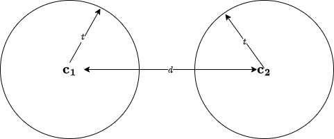

## Core Concepts

#### Linear Code

If a code $\mathcal{C}$ is also a **group**, then we call it *linear code*.

A great property of *linear code* is that:
- the minimum distance of code equals the minimum weight 
    $$
        d(\mathbf{x}, \mathbf{y}) = w(\mathbf{x} - \mathbf{y})
    $$
    since $\mathbf{x}, \mathbf{y} \in \mathcal{C}$ and $\mathbf{x} - \mathbf{y} \in \mathcal{C}$ ($\mathcal{C}$ is a group), then we must have:
    $$
        d_{min}(\mathcal{C}) = w_{min}(\mathcal{C})
    $$

 

#### Dimension of Kernel

there is a map $\varphi: \mathbb{R}^3 \rightarrow \mathbb{R}^2$, for example, given a matrices:
$$
A = 
\begin{pmatrix}
1 & 2 & 3 \\ 
4 & 5 & 6 \\
\end{pmatrix}
$$

and a vector $\mathbf{x} \in \mathbb{R}^3$, we have the kernel representation:
$$
K(\varphi) = \{\mathbf{x} | A \cdot \mathbf{x} = \mathbf{0}\}
$$

equivalently:
$$
\begin{aligned}
x_1 + 2 x_2 + 3 x_3 = 0 \\
4 x_1 + 5 x_2 + 6 x_3 = 0 \\
\end{aligned}
$$
then we have solution $x_1 = -x_3, x_2 = 2 x_3$. Finally we have the representation of $\mathbf{x}$:
$$
\mathbf{x} = 
\begin{pmatrix}
-x \\
2x \\
x \\
\end{pmatrix}
$$

 

So, kernel $K(\varphi)$ is spaned by a vector $(-1, 2, 1)$, the dimension of kernel is 1. This is a 1-dimensional subspace of $\mathbb{R}^3$.

 

#### Rank-Nullity Theorem

$$
Dim(D) = rank(\varphi) + nullity(\varphi)
$$

where:

-  nullity($\varphi$) : dimension of kernel $K(\varphi)$, say $dim(\mathbf{x})$, it's $1$ for above example

-  rank($\varphi$) : dimension of image $Img(\varphi)$, say $dim(A \cdot \mathbf{x})$, it's $2$ for above example

-  dim($D$) : dimension of domain, say $dim(\mathbb{R}^3)$,it's $3$ for above example

 

#### Dual Codes

> all defined over binary field $F_2$.

 

Generator matrices $G$ of an $[n, k]$ code $\mathcal{C}$:
$$
G = [I_k | A]
= \begin{bmatrix}
1 & 0 & 0 & 0 \mid 0 & 1 & 1 \\
0 & 1 & 0 & 0 \mid 1 & 0 & 1 \\
0 & 0 & 1 & 0 \mid 1 & 1 & 0 \\
0 & 0 & 0 & 1 \mid 1 & 1 & 1 \\
\end{bmatrix}
$$

 

parity check matrces $H$ of code $\mathcal{C}$:
$$
H = [-A^T | I_{n - k}] = [A^T | I_{n - k}]
= \begin{bmatrix}
0 & 1 & 1 & 1 \mid 1 & 0 & 0 \\
1 & 0 & 1 & 1 \mid 0 & 1 & 0 \\
1 & 1 & 0 & 1 \mid 0 & 0 & 1 \\
\end{bmatrix}
$$

 

message $\mathbf{m} = \begin{pmatrix}x_0 \\ x_1 \\ x_2 \\ x_3 \end{pmatrix}$, codeword $\mathbf{x}$ of code $\mathcal{C}$ looks like:
$$
\mathbf{x} = G^T \cdot \mathbf{m} =
\begin{pmatrix}
x_0 \\
x_1 \\
x_2 \\
x_3 \\
x_1 + x_2 + x_3 \\
x_0 + x_2 + x_3 \\
x_0 + x_1 + x_3 \\
\end{pmatrix}
$$

 

$H$ is also the generator matrix of some code $\mathcal{C}^{\perp}$, message $\mathbf{m'} = \begin{pmatrix}x_0' \\ x_1' \\ x_2' \end{pmatrix}$, then codeword $\mathbf{x'}$ of code $\mathcal{C}^{\perp}$ looks like:
$$
\mathbf{x'} = 
\begin{pmatrix}
x_1' + x_2' \\
x_0' + x_2' \\
x_0' + x_1' \\
x_0' + x_1' + x_2' \\
x_0' \\
x_1' \\
x_2' \\
\end{pmatrix}
$$

Two conclusions:
- $G$ and $H$ are generator and parity check matrices of code $\mathcal{C}$, at the same time, $H$ and $G$ are also generator and parity check matrices of code $\mathcal{C}^{\perp}$
    $$
    \begin{aligned}
    H \cdot (G^T \cdot \mathbf{m}) = H \cdot \mathbf{x} = \mathbf{0} \\
    G \cdot (H^T \cdot \mathbf{m'}) = G \cdot \mathbf{x'}= \mathbf{0} \\
    \end{aligned}
    $$

- codeword $\mathbf{x}$ is conjugative with codeword $\mathbf{x'}$, say $\langle \mathbf{x} \cdot \mathbf{x'} \rangle = 0$
    $$
    \mathcal{C}^{\perp} = \{\mathbf{x} \in \mathbb{F}_q^n | \mathbf{x} \cdot \mathbf{c} = 0, \mathbf{c} \in \mathcal{C} \}
    $$

- If $\mathcal{C} = \mathcal{C}^{\perp}$, then we can say $\mathcal{C}$ is *self-dual* code

 

What is *self-dual* anyway?

 

Let's take the $[8, 4]$ code $\mathcal{C}$ as example for illustration:
$$
G = 
\begin{bmatrix}
1 & 0 & 0 & 0 \mid 0 & 1 & 1 & 1 \\
0 & 1 & 0 & 0 \mid 1 & 0 & 1 & 1 \\
0 & 0 & 1 & 0 \mid 1 & 1 & 0 & 1 \\
0 & 0 & 0 & 1 \mid 1 & 1 & 1 & 0 \\
\end{bmatrix},
H = 
\begin{bmatrix}
0 & 1 & 1 & 1 \mid 1 & 0 & 0 & 0\\
1 & 0 & 1 & 1 \mid 0 & 1 & 0 & 0\\
1 & 1 & 0 & 1 \mid 0 & 0 & 1 & 0\\
1 & 1 & 1 & 0 \mid 0 & 0 & 0 & 1\\
\end{bmatrix}
$$

 

Then we have codeword $\mathbf{x}$ of code $\mathcal{C}$ and codeword $\mathbf{x'}$ of code $\mathcal{C}^{\perp}$:
$$
\mathbf{x} = \begin{pmatrix}
x_0 \\
x_1 \\
x_2 \\
x_3 \\
x_1 + x_2 + x_3 \\
x_0 + x_2 + x_3 \\
x_0 + x_1 + x_3 \\
x_0 + x_1 + x_2 \\
\end{pmatrix},
\mathbf{x'} = \begin{pmatrix}
x_1 + x_2 + x_3 \\
x_0 + x_2 + x_3 \\
x_0 + x_1 + x_3 \\
x_0 + x_1 + x_2 \\
x_0 \\
x_1 \\
x_2 \\
x_3 \\
\end{pmatrix}
$$

 

then we can obtain the table of code $\mathcal{C}$:
$$
\def\arraystretch{1.5}
   \begin{array}{c:c:c}
   \mathbf{m} & \mathbf{x} \\ \hline
   0000 & 00000000 \\ \hdashline
   1000 & 10000111 \\ \hdashline
   0100 & 01001011 \\ \hdashline
   1100 & 11001100 \\ \hdashline
   0010 & 00101101 \\ \hdashline
   1010 & 10101010 \\ \hdashline
   0110 & 01100110 \\ \hdashline
   1110 & 11100001 \\ \hdashline
   0001 & 00011110 \\ \hdashline
   1001 & 10011001 \\ \hdashline
   0101 & 01010101 \\ \hdashline
   1101 & 11010010 \\ \hdashline
   0011 & 00110011 \\ \hdashline
   1011 & 10110100 \\ \hdashline
   0111 & 01111000 \\ \hdashline
   1111 & 11111111 \\ \hdashline
   \end{array}
$$

and the table of code $\mathcal{C}^{\perp}$:
$$
\def\arraystretch{1.5}
   \begin{array}{c:c:c}
   \mathbf{m} & \mathbf{x'} \\ \hline
   0000 & 00000000 \\ \hdashline
   1000 & 01111000 \\ \hdashline
   0100 & 10110100 \\ \hdashline
   1100 & 11001100 \\ \hdashline
   0010 & 11010010 \\ \hdashline
   1010 & 10101010 \\ \hdashline
   0110 & 01100110 \\ \hdashline
   1110 & 00011110 \\ \hdashline
   0001 & 11100001 \\ \hdashline
   1001 & 10011001 \\ \hdashline
   0101 & 01010101 \\ \hdashline
   1101 & 00101101 \\ \hdashline
   0011 & 00110011 \\ \hdashline
   1011 & 01001011 \\ \hdashline
   0111 & 10000111 \\ \hdashline
   1111 & 11111111 \\ \hdashline
   \end{array}
$$

 

We can say code $\mathcal{C}$ is *self-dual* since $\mathcal{C} = \mathcal{C}^{\perp}$.

 

Let's take a closer look at the $[8, 4]$ code $\mathcal{C}$, what properties can we find:
1. length of code is a even number, $|\mathcal{C}| = n = 2^4 = 16$
2. dimension of code $dim(\mathcal{C}) = n / 2= 8$
3. minimum distance $d_{min}(\mathcal{C}) = 4$
4. inner product of any two codewords is $0$, $\langle \mathbf{x}, \mathbf{y} \rangle = 0, \mathbf{x}, \mathbf{y} \in \mathcal{C}$

    $$
    \langle \mathbf{x}, \mathbf{y} \rangle = \sum_i x_i \cdot y_i \mod 2 = 0
    $$

From property of $\boxed{4}$, we can also conclude that code $\mathcal{C}$ is also *self-orthogonal*.

 

#### Self-Orthogonal Binary Code

Let's dig into self-orthogonal a little more, and see what properties does it have.

 

Another example of $[7, 4]$ code $\mathcal{C}$, with parity check matrix:
$$
H = 
\begin{bmatrix}
1 & 1 & 0 & 1 \mid 1 & 0 & 0 \\ 
0 & 1 & 1 & 1 \mid 0 & 1 & 0 \\
1 & 1 & 1 & 0 \mid 0 & 0 & 1 \\
\end{bmatrix}
$$
$H$ is also generator matrix of $[7, 3]$ code $\mathcal{C}^{\perp}$, then the code $\mathcal{C}^{\perp}$ would be like:
$$
\def\arraystretch{1.5}
   \begin{array}{c:c:c}
   \mathbf{m} & \mathbf{x'} \\ \hline
   000 & 0000000 \\ \hdashline
   100 & 1101100 \\ \hdashline
   010 & 0111010 \\ \hdashline
   110 & 1010110 \\ \hdashline
   001 & 1110001 \\ \hdashline
   101 & 0011101 \\ \hdashline
   011 & 1001011 \\ \hdashline
   111 & 0100111 \\ \hdashline
   \end{array}
$$

 

Generator matrix of $[7, 4]$ code $\mathcal{C}$ is:
$$
G = 
\begin{bmatrix}
1 & 0 & 0 & 0 \mid 1 & 0 & 1 \\
0 & 1 & 0 & 0 \mid 1 & 1 & 1 \\
0 & 0 & 1 & 0 \mid 0 & 1 & 1 \\
0 & 0 & 0 & 1 \mid 1 & 1 & 0 \\
\end{bmatrix}
$$
then the code $\mathcal{C}$ would be like:
$$
\def\arraystretch{1.5}
   \begin{array}{c:c:c}
   \mathbf{m} & \mathbf{x} \\ \hline
   0000 & 0000000 \\ \hdashline
   1000 & 1000101 \\ \hdashline
   0100 & 0100111 \\ \hdashline
   1100 & 1100010 \\ \hdashline
   0010 & 0010011 \\ \hdashline
   1010 & 1010110 \\ \hdashline
   0110 & 0110100 \\ \hdashline
   1110 & 1110001 \\ \hdashline
   0001 & 0001110 \\ \hdashline
   1001 & 1001011 \\ \hdashline
   0101 & 0101001 \\ \hdashline
   1101 & 1101100 \\ \hdashline
   0011 & 0011101 \\ \hdashline
   1011 & 1011000 \\ \hdashline
   0111 & 0111010 \\ \hdashline
   1111 & 1111111 \\ \hdashline
   \end{array}
$$

We call code $\mathcal{C}^{\perp}$ is *self-orthogonal* since $\mathcal{C}^{\perp} \subseteq \mathcal{C}$.

 

#### Reed-Muller Code

Reed-Muller code $\mathcal{C}(r, m)$:
- $m$ represents the number of variables, it's the dimension of evaluation domain
- $r$ represents the maximum degree of *multivariate polynomial* for evaluation

 

There are four aspects to consider while constructing Reed-Muller Code:
1. evaluation domain $D$, if $m = 3$, then there are $2^m = 8$ evaluation points
2. evaluation polynomials, $f_0$ denotes polynomial with degree-$0$, $f_1$ denotes polynomial with degree-$1$, ...
3. evaluate one-by-one, $f_0(D), f_1(D), ...$, forms the generator matrix $G$

 

Generator matrix of Reed-Muller Code $\mathcal{R}(r, m)$:
$$
G(r, m) = 
\begin{bmatrix}
G(r, m - 1) & G(r, m - 1) \\
O & G(r - 1, m - 1)
\end{bmatrix}
$$
- dimension of code $\mathcal{R}(r, m)$ (number rows of generator matrix) equals
    $$
    \begin{pmatrix}m \\ 0\end{pmatrix} + \begin{pmatrix}m \\ 1\end{pmatrix} + \begin{pmatrix}m \\ 2\end{pmatrix} + ... + \begin{pmatrix}m \\ r\end{pmatrix}
    $$
- minimum weight (distance) of code $\mathcal{R}(r, m)$ equals $2^{m - r}$

 

For example, for $G(0, 1)$, there are two points(one variable) $x_0 = [0, 1]$, and one constant polynomial $f_0(x_0) = 1$:
$$
G(0, 1) = 
\begin{bmatrix}
1 & 1 \\
\end{bmatrix}
$$

Another example, for $G(1, 1)$, there are also two points(one variable) $x_0 = [0, 1]$, and two polynomials $f_0(x_0) = 1, f_1(x_0) = x_0$:
$$
G(1, 1) = 
\begin{bmatrix}
1 & 1 \\
0 & 1 \\
\end{bmatrix}
$$

We observe that $G(1, 1)$ is actually an identity matrix $I_{2^1} = \begin{bmatrix}1 & 0 \\ 0 & 1 \\ \end{bmatrix}$, why? since their cooresponding codes are equal, code $\mathcal{C}$ generated by $G(1, 1)$:
$$
\mathcal{C} = G(1, 1)^T \cdot \begin{pmatrix} x_0 \\ x_1 \\ \end{pmatrix} = 
\begin{pmatrix}
x_0 \\ x_0 + x_1 \\
\end{pmatrix}
$$
table of code $\mathcal{C}$:
$$
\def\arraystretch{1.5}
   \begin{array}{c:c}
   \mathbf{m} = (x_0, x_1) & \mathbf{x} \\ \hline
   00 & 00 \\ \hdashline
   01 & 01 \\ \hdashline
   10 & 11 \\ \hdashline
   11 & 10 \\ \hdashline
   \end{array}
$$

 

Similarly, code $\mathcal{C'}$ generated by $I_{2^1}$:
$$
C' = I_2^T \cdot \begin{pmatrix} x_0 \\ x_1 \\ \end{pmatrix} = 
\begin{pmatrix}
x_0 \\ x_1 \\
\end{pmatrix}
$$
table of code $\mathcal{C'}$:
$$
\def\arraystretch{1.5}
   \begin{array}{c:c}
   \mathbf{m} = (x_0, x_1) & \mathbf{x} \\ \hline
   00 & 00 \\ \hdashline
   01 & 01 \\ \hdashline
   10 & 10 \\ \hdashline
   11 & 11 \\ \hdashline
   \end{array}
$$

Obviously we have $\mathcal{C} = \mathcal{C'}$, so we can conclude that generator matrix $G(1, 1) \equiv I_{2^1}$.

 

More generally, we have $G(m, m) \equiv I_{2^m}$.

 

#### Minimum Distance VS Partity Check Matrix

The minimum distance of a linear code $\mathcal{C}$ equals the least number of independent columns of parity check matrix.

 

For example, a parity check matrix:
$$
H = 
\begin{bmatrix}
0 & 0 & 0 & 1 & 1 & 1 & 1 \\
0 & 1 & 1 & 0 & 0 & 1 & 1 \\
1 & 0 & 1 & 0 & 1 & 0 & 1 \\
\end{bmatrix}
$$

The minimum independent columns is $3$, such as column $1, 2, 3$, sum of these three columns $[0, 0, 1] + [0, 1, 0] + [0, 1, 1] = [0, 0, 0]$. So the minimum distance of the cooresponding code to $H$ is $3$.

 

## Decoder

Theorem 1.11.2:
*If $d$ is the minimum distance of a code $\mathcal{C}$(linear or nonlinear) and $t = \lfloor (d - 1) / 2 \rfloor$, then spheres of radius $t$ about distinct codewords are disjoint*.

 

What does it mean? Let's see a drawing below:

Two codewords $\mathbf{c_1}, \mathbf{c_2} \in \mathcal{C}$, the minimum distance of code $\mathcal{C}$ is $d$. There must exists a radius $t = \lfloor (d - 1) / 2 \rfloor$, so that two spheres centred by $\mathbf{c_1}$ and $\mathbf{c_2}$ are disjoint by each other.

 

What is *sphere* anyway? Providing a codeword $\mathbf{c_1}$, the maximum tolerance distance between two codewords $t$, and codeword $\mathbf{c_1}$ is defined over finite field $\mathbb{F}_q^n$. Then there are:
$$
\sum_{i = 0}^{t} \binom{n}{i}(q - i)^i
$$
vectors whose distance against to codeword $\mathbf{c_1}$ are under $t$, say $d(\mathbf{y}, \mathbf{c_1})< t$. And these codewords consisting a sphere!

 

Important conclusions:

1. Providing a specific vector $\mathbf{y}$ is received, and the maximum error tolerance $t$ is determined, we can recover the unique cooresponding codeword $\mathbf{c_1}$
2. Maximum the capacibility of error correcting $t$ is maximum minimum distance $d$ of codeword $\mathcal{C}$

 

#### Syndrom(Coset) Decoder

Assume we have a code $\mathcal{C}$:
$$
\def\arraystretch{1.5}
   \begin{array}{c:c}
   \mathbf{x} & \mathcal{C} = G^T \cdot \mathbf{x} \\ \hline
   00 & 00000 \\ \hdashline
   01 & 01110 \\ \hdashline
   10 & 10101 \\ \hdashline
   11 & 11011 \\ \hdashline
\end{array}
$$
generated by a generator $G$:
$$
G = 
\begin{pmatrix}
1 & 0 & 1 & 0 & 1 \\
0 & 1 & 1 & 1 & 0 \\
\end{pmatrix}
$$

And the parity check matrix $H$:
$$
H = 
\begin{pmatrix}
1 & 1 & 1 & 0 & 0 \\
0 & 1 & 0 & 1 & 0 \\
1 & 0 & 0 & 0 & 1 \\
\end{pmatrix}
$$

 

$\mathbb{F}_q^5$ is divided into $2^{5 - 2}$ cosets by code $\mathcal{C}$, each coset has a *coset leader*. The *coset leader* is actually what we called *error term* $e$. Assume: 
$$
\mathbf{y} = \mathbf{c} + \mathbf{e}
$$
where $\mathbf{y}$ is received vector, $\mathbf{c}$ is the sended codeword, and $\mathbf{e}$ is the error term. We have:
$$
\mathbf{s} = H \cdot \mathbf{y} = H \cdot \mathbf{c} + H \cdot \mathbf{e} = H \cdot \mathbf{e}
$$
$s$ is what we called **Syndrome**. Finally we can obtain the relation table of **Syndrome** and **Error Term**.
$$
\def\arraystretch{1.5}
   \begin{array}{c:c}
   \mathbf{e} & \mathbf{s} \\ \hline
   00000 & 000 \\ \hdashline
   00001 & 001 \\ \hdashline
   00010 & 010 \\ \hdashline
   00011 & 011 \\ \hdashline
   00100 & 100 \\ \hdashline
   10000 & 101 \\ \hdashline
   01000 & 110 \\ \hdashline
   11100 & 111 \\ \hdashline 
\end{array}
$$

Therefore if we have a syndrome $s$, we can get the error term $e$ though one query. Then we can easily recover the sending codeword $c = y - e$.

 

Another words, if two receiving vectors $y_1$ and $y_2$ have the same **syndrome** $s$, so they belong to the same coset, and have the same sending codeword. Along with code $\mathcal{C} = \{00000, 01110, 10101, 11011 \}$, if the receiving vector is $01100$, then the cooresponding *coset leader* is $00010$, and sending codeword would be $01110$.

 

A question: how to calculate the syndrome table efficiently? It seems to be involved...

- coset with weight $0$ (no error) has coset leader $\mathbf{0}$, the syndrome is $\mathbf{0}$ too
- coset with weight $1$ (only one error) has coset leader with $i$th of $1$ and else where with $0$, actually it's the $i$th column of parity check matrix $H$ (there are $\binom{n}{1}$ coset leader & syndrome pairs)
- coset with weight $2$ (two errors) has coset leader with $i, j$ of $1$ and else where with $0$, syndrome is the sum of $i$th and $j$th columns of parity check matrix $H$ (there are $\binom{n}{2}$ coset leader & syndrome pairs)
- ...
- coset with weight $t$ (t errors) has coset leader with ...

 

*How about Syndrome Decoding for Binary Hamming Codes*?

For example, a hamming code $\mathcal{H}_3$ with parameters $[7, 4, 3]$, the parity check matrix is binary representation of numbers from $1$ to $7$:
$$
H_3 = 
\begin{bmatrix}
1 & 0 & 1 & 0 & 1 & 0 & 1 \\
0 & 1 & 1 & 0 & 0 & 1 & 1 \\
0 & 0 & 0 & 1 & 1 & 1 & 1 \\
\end{bmatrix}
$$

If the receiving vector is $y = 1110011$, then its syndrome is $001$ (binary representation of $4$), we set $4$th bit of $y$ with $1$. So the sending codeword would be $1111011$. We do not need a *Syndrome table* for *Binary Hamming Code* anymore.

 

What does the particular parity check matrix actually mean?
- the first row checks whether the least bit is $1$ or not, position $[1, 3, 5, 7]$
- the second row checks whether the second bit from right is $1$ or not, position $[2, 3, 6, 7]$
- the third row checks whether the third bit from right is $1$ or not, position $[4, 5, 6, 7]$

 

Summary for that, given a receiving vector we want to know which codeword is closest to it? **Coset Decoding** with $q^{n - k}$ entries is more efficient than brute force method with a table of $q^n$ entries.

 

#### Error Analysis

If there's no encoding, the error probability of message transmitting with length $k$ in BSC channel would be:
$$
P_{err} = 1 - (1 - \rho)^k
$$

If encoding is applied, the error probability would be:
$$
P_{err} = 1 - \sum_{i = 0}^t \binom{n}{i} \rho^i \cdot (1 - \rho)^{n - i}
$$

For example, after appling $[7, 4]$ binary hamming code $\mathcal{H}_3$ the error probability is $0.002 031 04$, if there's no encoding, it would be $0.039 403 99$. Super benefical, right?

 

#### Capacity of Channel

$$
C(\rho) = 1 + \rho \cdot \log \rho + (1 - \rho) \cdot \log {(1 - \rho)}
$$

A code $[n, k]$, $k / n$ is what we called *infomation rate*.

 

#### Cyclotomic Coset

$$
C_s = \{s, s \cdot q, s \cdot q^2, ..., s \cdot q^{r - 1}\} \mod q^t - 1
$$
where $r$ is the smallest number satisfy $s \cdot q^r = s \mod q^t - 1$.

 

For example, $2$-cyclotomic cosets modulo $15$ are:
$$
\begin{aligned}
C_0 &= \{0\} \\
C_1 &= \{1, 2, 4, 8\} \\
C_3 &= \{3, 6, 12, 9\} \\
C_5 &= \{5, 10\} \\
C_7 &= \{7, 14, 13, 11\} \\
\end{aligned}
$$

 

## Cyclic Code

> Polynomial $x^n - 1$ defined over finite field $\mathbb{F}_q$, has no repeated irreducible factors if and only if $q$ and $n$ are relatively prime, where charactor of $\mathbb{F}_q$ is $p$.

 

Proof:

If $f(x) = x^n - 1$ has repeated irreducible factors, say $f(x) = g(x)^a \cdot h(x)$, then derivative of $f(x)$:
$$
f(x)' = n \cdot x^{n - 1} = 0
$$
have roots. Since $x^{n - 1} \ne 1$, we must have $n \equiv p \equiv 0$, $p$ divides $n$.

On the contrary, if $x^n - 1$ has no repeated irreducible factors, $p$ and $n$ are co-prime.

 

For example, $p = 2, n = 3$, they are co-prime, then:
$$
x^3 - 1 = (x - 1)(x^2 + x + 1)
$$
has no repeated irreducible polynomials. Another example, $p = 2, n = 4$, they are not co-prime, then:
$$
x^4 - 1 = (x - 1)^4
$$
has $4$ repeated irreducible polynomials.

 

#### Encoding with Generator Polynomial

Encode $[7, 3]$ binary cyclic code $\mathcal{C}$ with generator polynomial $g(x) = 1 + x + x^2 + x^4$, the generator matrix:
$$
G = 
\begin{bmatrix}
1 & 1 & 1 & 0 & 1 & 0 & 0 \\
0 & 1 & 1 & 1 & 0 & 1 & 0 \\
0 & 0 & 1 & 1 & 1 & 0 & 1 \\
\end{bmatrix}
$$

code $\mathcal{C}$ will be like:
$$
\def\arraystretch{1.5}
   \begin{array}{c:c}
   message & codeword \\ \hline
   000 & 0000000 \\ \hdashline
   001 & 0011101 \\ \hdashline
   010 & 0111010 \\ \hdashline
   011 & 0100111 \\ \hdashline
   100 & 1110100 \\ \hdashline
   101 & 1101001 \\ \hdashline
   110 & 1001110 \\ \hdashline
   111 & 1010011 \\ \hdashline
   \end{array}
$$
any shifted *non-zero* codeword will also be in $\mathcal{C}$, for example, shifted $0011101$ is $1001110$. Why is $\mathcal{C}$ a cyclic code? The reason is that generator polynomial $g(x)$ is ONE factor of modulus polynomial $x^7 - 1$:
$$
x^7 - 1 = (1 + x + x^2 + x^4) \cdot (1 + x^2 + x^3) 
$$

 

If not, what will happen? Assume $g(x) = 1 + x^3$, not a factor of $x^7 - 1$. 
$$
G = 
\begin{bmatrix}
1 & 0 & 0 & 1 & 0 & 0 & 0 \\
0 & 1 & 0 & 0 & 1 & 0 & 0 \\
0 & 0 & 1 & 0 & 0 & 1 & 0 \\
\end{bmatrix}
$$
then the cooresponding code will be like:
$$
\def\arraystretch{1.5}
   \begin{array}{c:c}
   message & codeword \\ \hline
   000 & 0000000 \\ \hdashline
   001 & 0010010 \\ \hdashline
   010 & 0100100 \\ \hdashline
   011 & 0110110 \\ \hdashline
   100 & 1001000 \\ \hdashline
   101 & 1011010 \\ \hdashline
   110 & 1101100 \\ \hdashline
   111 & 1111110 \\ \hdashline
   \end{array}
$$
Obviously it not a cyclic code, and its minimus distance is not a constant anymore.

 

## References

[1] [Fundamentals of Error Correcting Code](https://theswissbay.ch/pdf/Gentoomen%20Library/Information%20Theory/Coding%20Theory/Fundamentals%20of%20Error-Correcting%20Codes%20-%20W.%20Cary%20Huffman.pdf)